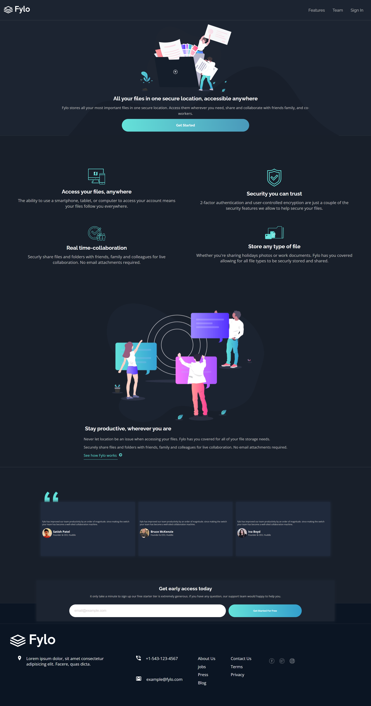

# Frontend Mentor - Fylo dark theme landing page solution

This is a solution to the [Fylo dark theme landing page challenge on Frontend Mentor](https://www.frontendmentor.io/challenges/fylo-dark-theme-landing-page-5ca5f2d21e82137ec91a50fd). Frontend Mentor challenges help you improve your coding skills by building realistic projects.

## Table of contents

- [Overview](#overview)
  - [The challenge](#the-challenge)
  - [Screenshot](#screenshot)
  - [Links](#links)
- [My process](#my-process)
  - [Built with](#built-with)
  - [What I learned](#what-i-learned)

## Overview

This is simple dark theme landing page with some active properties.

### The challenge

Users should be able to:

- View the optimal layout for the site depending on their device's screen size
- See hover states for all interactive elements on the page

### Screenshot

.png>)

### Links

- Solution URL: [Solution](https://www.frontendmentor.io/solutions/this-is-a-simple-dark-landing-page-which-is-the-mobile-first-design-tXUz3dNT6i)
- Live Site URL: [Netlify](https://dark-landing-9000.netlify.app/)

## My process

### Built with

- Semantic HTML5 markup
- CSS custom properties
- Flexbox

### What I learned

This is an amazing project I working on. I learned various css properties with this project, and facing many problems doing css designs but after all I tried this challenge to make design as same as possible as I can. 

